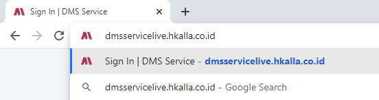
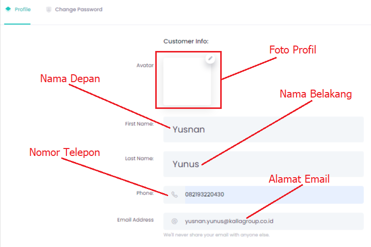

---

sidebar_position: 2
id: basicoperation
title: BASIC OPERATION
sidebar_label: BASIC OPERATION
toc_max_heading_level: 4
hide_title: true
---

Bagian ini menjelaskan tentang cara pengoperasian dasar Dealer Management System Services.

### Membuka Aplikasi

Aplikasi ini dapat di akses menggunakan browser (direkomendasikan menggunakan Google Chrome terbaru), selanjutnya ketik **[dmsservice.hkalla.co.id](https://dmsservice.hkalla.co.id)** di isian address browser.

### Akses Aplikasi

Untuk akses aplikasi silahkan login menggunakan Email dan Pasword yang telah diberikan.

:::tip Note

Pop-up diatas akan muncul apabila user salah memasukkan email dan password atau salah satu nya.

:::

Setelah proses login selesai maka akan muncul tampilan seperti berikut.

Keterangan :
1. **Navigation Menu** : menampilkan menu edit data akun dan juga logout.

pada gambar diatas yang di beri kotak merah, merupakan field inputan yang bisa di update jika terdapat kesalahan atau perubahan data yang tidak sesuai.

pada gambar diatas yang di beri kotak merah, digunakan untuk melakukan reset password atau pergantian password yang telah di berikan oleh administrator, lalu tinggal memasukkan password yang baru.

2. **Navigation Bar** : Menampilkan menu-menu yang ada di aplikasi ini.

3. **Dropdown Button** : Menampilkan menu ikon beserta teksnya.

4. **Dashboard Aftersales** : Menampilkan data dalam bentuk grafik dan chart.

### Action Pada List View
Berikut ini adalah penjelasan tampilan icon pada list view.

| Action | Fungsi |
|--------|--------|
|  | menambah data |
|  | **Edit** : Ubah Data, **Delete** : Hapus Data |
|  | Filter untuk menampilkan jumlah data yang tampil. |
|  | Menampilkan data berdasarkan keyword text yang di input. |
|  | Mencetak bukti bayar, yang nantinya kustomer memberikan kepada kasir bahwa invoice telah terbayar. |
|  | Menambah keluhan kustomer |
|  | Menambah job pengerjaan |
|  | Menambah Part untuk pengerjaan |
|  | Memilih stall yang akan digunakan untuk pengerjaan unit |
|  | Menyimpan work order |
|  | Mencetak work order |
|  | Melanjutkan ke proses selanjutnya |
|  | Mengunduh laporan |
|  | Menghitung ulang total job dan part yang ada pada Work Order |
|  | Memilih Stall untuk unit kendaraan. |